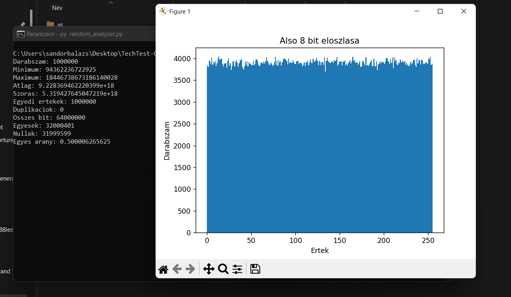
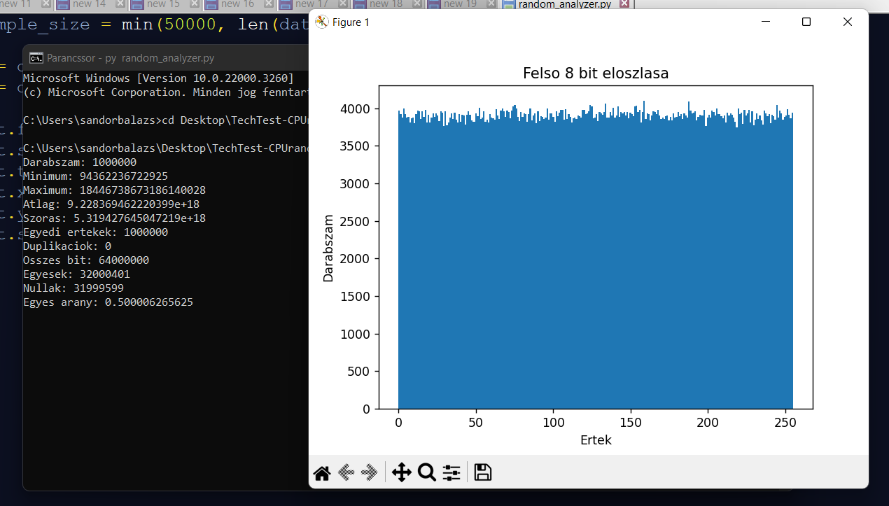
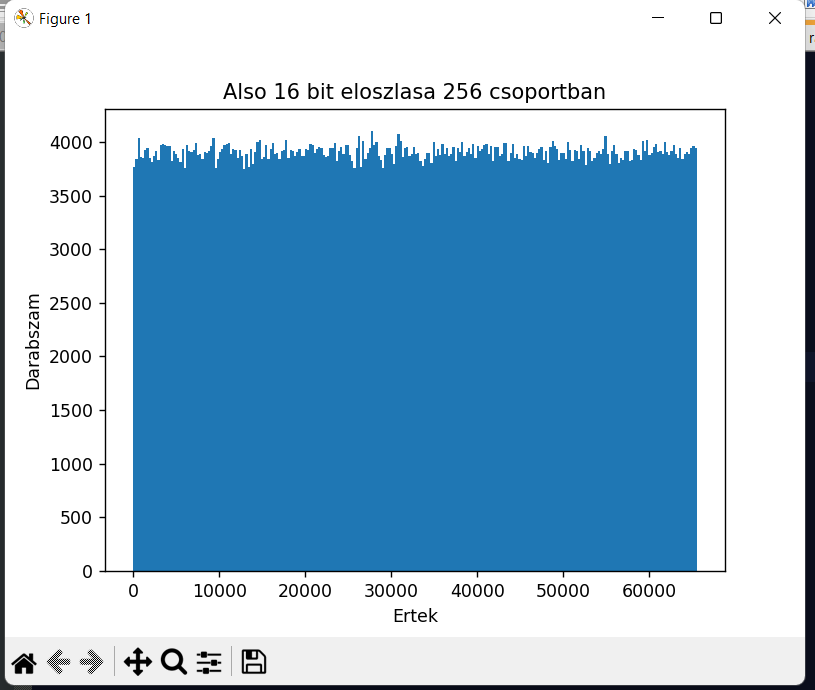
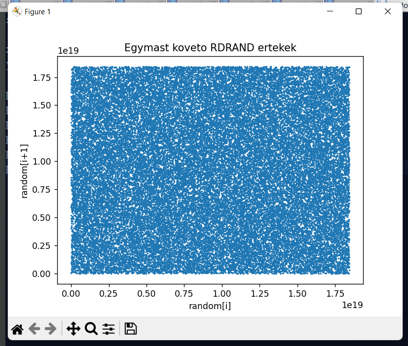
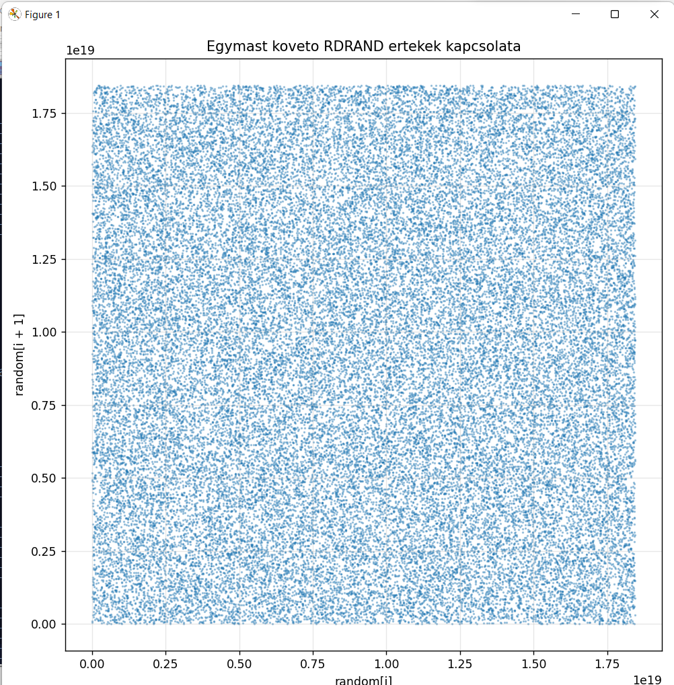
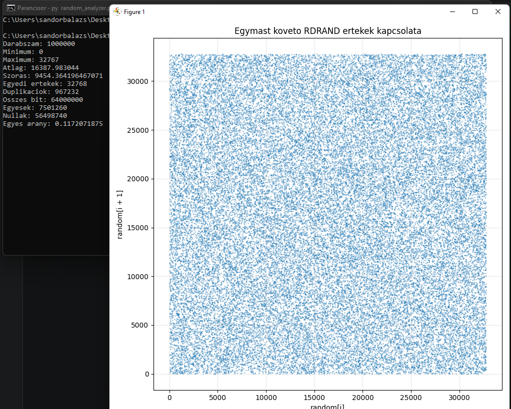

# CPU_RandomTest

Egyszerű C++ és Python alapú kísérlet az Intel CPU-k hardveres véletlenszám-generátorának (RDRAND) vizsgálatára.

A projekt célja nem kriptográfiai minősítés vagy tudományos bizonyítás, hanem annak bemutatása, hogy:

- hogyan érhető el a CPU hardveres RNG-je C++ nyelvből,
- hogyan generálható nagy mennyiségű 64 bites véletlen szám,
- hogyan végezhetők rajtuk alapvető statisztikai vizsgálatok,
- milyen eloszlásokat és mintázatokat várhatunk egy jó minőségű véletlengenerátortól.

---

## Hardver

A mérés az alábbi rendszeren készült:

| Komponens | Érték |
|-----------|--------|
| CPU | Intel Core i7-10750H |
| RNG forrás | Intel RDRAND |
| Fordító | Microsoft Visual C++ 2022 |
| Elemzés | Python + NumPy + Matplotlib |

---

## Projekt felépítése

### CPU_RandomTest

C++ konzolos alkalmazás.

Feladata:

1. A CPU RDRAND utasításának használata.
2. 64 bites véletlen számok generálása.
3. Az eredmények mentése `random.txt` fájlba.

### random_analyzer.py

Python elemző szkript.

Feladata:

- a generált adatok beolvasása,
- alapvető statisztikai vizsgálatok elvégzése,
- grafikonok készítése.

---

## Minta mérete

A vizsgálathoz:

```text
1 000 000 db
```

64 bites véletlen szám került generálásra.

Ez összesen:

```text
64 000 000 bit
```

vizsgálatát teszi lehetővé.

---

# Mérési eredmények

## Alapstatisztikák

```text
Darabszam: 1000000

Minimum: 94362236722925
Maximum: 18446738673186140028

Atlag: 9.228369462220399e+18
Szoras: 5.319427645047219e+18

Egyedi ertekek: 1000000
Duplikaciok: 0

Osszes bit: 64000000

Egyesek: 32000401
Nullak: 31999599

Egyes arany: 0.500006265625
```

---

## Megfigyelések

### Nincs duplikáció

Az egymillió generált érték között nem található ismétlődés.

```text
Duplikációk: 0
```

Ez megfelel az elvárásoknak egy 64 bites véletlen számtér esetén.

---

### Bitarány

A generált 64 millió bit közel pontosan fele-fele arányban tartalmaz 0 és 1 értékeket.

```text
0-k száma: 31 999 599
1-ek száma: 32 000 401
```

Az 1-esek aránya:

```text
50.0006265625 %
```

A különbség statisztikailag elhanyagolható.

---

# Grafikonok

## 1. Alsó 8 bit eloszlása

A 64 bites számok legalsó byte-jának eloszlása.

Ideális esetben minden érték közel azonos gyakorisággal fordul elő.



### Mit látunk?

A 256 lehetséges érték közel azonos gyakorisággal jelenik meg.

Nem figyelhető meg kiugró érték vagy látható torzulás.

---

## 2. Felső 8 bit eloszlása

A legfelső byte eloszlása.



### Miért érdekes?

Sok gyenge véletlengenerátor esetén a magasabb helyiértékű bitek viselkedése eltérhet az alacsonyabb bitekétől.

A hardveres RNG esetén hasonló egyenletességet várunk.

### Mit látunk?

A hisztogram közel egyenletes.

Nem látható szisztematikus torzítás.

---

## 3. Alsó 16 bit eloszlása

Az alsó 16 bit vizsgálata.

A 65536 lehetséges értéket 256 csoportba aggregáljuk.



### Mit látunk?

A csoportok terhelése közel azonos.

Az eloszlás továbbra is egyenletesnek látszik.

---

## 4. Egymást követő RDRAND értékek

Scatter plot az egymást követő értékek között.

X tengely:

```text
random[i]
```

Y tengely:

```text
random[i+1]
```



### Miért érdekes?

Számos gyenge pszeudovéletlen-generátor esetén ilyenkor:

- sávok,
- rácsszerkezet,
- geometriai minták

jelenhetnek meg.

### Mit látunk?

Nem figyelhető meg struktúra.

A pontok homogén módon töltik ki a teret.

---

## 5. Egymást követő RDRAND értékek kapcsolata

Nagyobb méretű, részben átlátszó scatter plot.



### Mit látunk?

A pontfelhő egyenletesnek és strukturálatlannak tűnik.

Nem látható korreláció vagy ismétlődő mintázat.

---

# Következtetések

A vizsgált 1 000 000 darab 64 bites minta alapján:

- az eloszlás egyenletesnek látszik,
- a bitarány közel tökéletesen 50-50%,
- nem jelentkezett duplikáció,
- nem figyelhető meg látható korreláció,
- az alsó és felső bitek viselkedése hasonló.

A mérés természetesen nem helyettesít professzionális RNG tesztcsomagokat (NIST SP800-22, Dieharder, PractRand stb.), azonban jól demonstrálja az Intel RDRAND utasításának működését és alapvető statisztikai tulajdonságait.

---

# Felhasznált technológiák

- C++
- Intel RDRAND
- Microsoft Visual C++ 2022
- Python 3
- NumPy
- Matplotlib

---

# Megjegyzés

Ez a projekt oktatási és demonstrációs célból készült.

A cél nem a hardveres RNG kriptográfiai minősítése, hanem a működésének szemléltetése és alapvető statisztikai vizsgálata.


# Kiegészítő kísérlet: C++ `std::rand()`

Összehasonlításképpen ugyanazt az elemzőkörnyezetet lefuttattam a klasszikus C++ `std::rand()` függvényen is.
Ez a kísérlet a CPURandom_Test_2 mappában található.

A teszt során:

- nem történt explicit seedelés (`std::srand()` nem került meghívásra),
- 1 000 000 darab szám került generálásra,
- ugyanaz a Python elemzőszkript került felhasználásra.

## Eredmények

```text
Darabszam: 1000000

Minimum: 0
Maximum: 32767

Atlag: 16387.983044
Szoras: 9454.364196467071

Egyedi ertekek: 32768
Duplikaciok: 967232

Osszes bit: 64000000

Egyesek: 7501260
Nullak: 56498740

Egyes arany: 0.1172071875
```

## Megfigyelések

A Microsoft Visual C++ implementációban a `RAND_MAX` értéke:

```text
32767
```

ami mindössze 15 bites számtartományt jelent.

Ennek következtében:

- a generátor legfeljebb 32768 különböző értéket tud előállítani,
- az 1 000 000 mintában rendkívül sok ismétlődés jelenik meg,
- a generált állapottér nagyságrendekkel kisebb a hardveres RDRAND által biztosított 64 bites tartománynál.

Ennek ellenére a scatter plot meglepően egyenletes eloszlást mutat, és szemmel nem figyelhető meg nyilvánvaló korreláció vagy geometriai mintázat.

## Egymást követő `rand()` értékek kapcsolata



## Következtetés

A klasszikus `std::rand()` nem tekinthető kriptográfiai minőségű véletlenszám-generátornak, és a rendelkezésre álló állapottér rendkívül kicsi a modern hardveres RNG-khez képest.

Ugyanakkor alapvető statisztikai vizsgálatok során az eloszlása meglepően jó képet mutat, ami jól szemlélteti, hogy egy egyszerű hisztogram vagy scatter plot önmagában nem elegendő egy véletlenszám-generátor minőségének megítéléséhez.